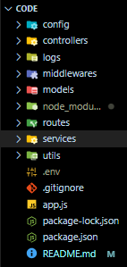

# Hospital-System-API-Nodejs

A scalable, modular Hospital Management System built with Node.js, MongoDB, and Firebase tools. It provides support for patients, doctors, nurses, pharmacy management, appointments, room assignments, and more.

---

## Project Structure

<center>  </center>

---

## Features

- **User Roles**: Patient, Doctor, Nurse, Manager, Admin, Pharmacy
- **Appointments**: Create, confirm, cancel with real-time status
- **Clinics**: Manage clinic dates, ticketing, payment
- **Pharmacy**: Medications, stock management, expiry dates
- **Doctors & Nurses**: Ratings, experience, available shifts
- **Medications**: Dosage, pricing, barcode, stock
- **Rooms**: Assign nurses, cleaning status, cost per day
- **Reviews**: Patients can rate doctors, clinics, and nurses
- **Password Recovery**: Send secure reset codes via email

---

## Technologies

- **Node.js + Express**
- **MongoDB + Mongoose**
- **JWT Authentication**
- **Nodemailer (email system)**
- **Multer (file uploads)**
- **Rate Limiting & Sanitization for security**

---

## Environment Variables

Create a `.env` file in the root directory:

```env
PORT=5000
MONGO_URI=mongodb://localhost:27017/hospital-db
JWT_SECRET=your_jwt_secret
EMAIL_USERNAME=your_email@example.com
EMAIL_PASSWORD=your_email_password
EMAIL_HOST=smtp.mailtrap.io
EMAIL_PORT=587
```

## Installation & Run

```
# Clone project
git clone https://github.com/diaaqassem/Hospital-System-API-Nodejs.git

# Install dependencies
npm install

# Run the server
npm run start:dev
```

## For Test API Using Postman and Hospital 'Management API file.json' in root directory
